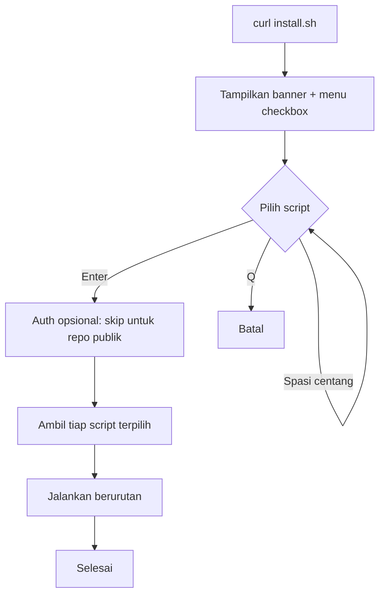

# wanforge.asia — Server Scripts

Kumpulan script setup server Linux. Dapat dijalankan satu per satu, atau lewat
launcher interaktif `install.sh` yang menampilkan menu checkbox multi-pilih.

Repositori publik, sehingga tidak memerlukan autentikasi untuk menjalankan.

## Persyaratan

- Sistem Linux dengan salah satu package manager: `apt`, `dnf`, `yum`, `pacman`,
  `zypper`, atau `apk`.
- `curl` dan akses `sudo` (atau dijalankan sebagai root).
- Terminal interaktif (script membaca input dari `/dev/tty`).

## Menjalankan lewat Launcher

Cara paling mudah. Menampilkan menu, pilih satu atau beberapa script sekaligus.

```bash
curl -fsSL https://raw.githubusercontent.com/wanforge/wanforge/master/.shell/install.sh | bash
```

Navigasi menu:

| Tombol        | Fungsi                          |
|---------------|---------------------------------|
| Panah Atas/Bawah | Pindah baris                 |
| Spasi         | Centang/lepas pilihan           |
| A             | Centang/lepas semua             |
| Enter         | Jalankan yang dicentang         |
| Q             | Batal keluar                    |

Script yang dicentang dijalankan berurutan sesuai urutan menu. Jika satu gagal,
sisanya tetap lanjut.

## Menjalankan Per Script

Setiap script juga bisa dijalankan langsung tanpa launcher.

```bash
# Update sistem + paket dasar (multi-distro)
curl -fsSL https://raw.githubusercontent.com/wanforge/wanforge/master/.shell/install-packages.sh | bash

# Set timezone (default Asia/Jakarta)
curl -fsSL https://raw.githubusercontent.com/wanforge/wanforge/master/.shell/set-timezone.sh | bash

# Install & konfigurasi firewall ufw
curl -fsSL https://raw.githubusercontent.com/wanforge/wanforge/master/.shell/install-firewall.sh | bash

# Install & aktifkan Fail2Ban
curl -fsSL https://raw.githubusercontent.com/wanforge/wanforge/master/.shell/install-fail2ban.sh | bash

# Install CloudPanel CE v2 (Debian/Ubuntu saja)
curl -fsSL https://raw.githubusercontent.com/wanforge/wanforge/master/.shell/install-cloudpanel.sh | bash
```

## Daftar Script

| Script                  | Fungsi                                                        | Interaktif |
|-------------------------|--------------------------------------------------------------|------------|
| `install.sh`            | Launcher menu checkbox untuk menjalankan script lain          | Ya         |
| `install-packages.sh`   | Update/upgrade sistem dan pasang paket dasar (micro, curl, wget, git, python3, dll) | Tidak |
| `set-timezone.sh`       | Set timezone via `timedatectl`, default `Asia/Jakarta`        | Ya         |
| `install-firewall.sh`   | Pasang `ufw`, buka OpenSSH/http/https, tambah port custom, aktifkan | Ya    |
| `install-fail2ban.sh`   | Pasang dan aktifkan layanan Fail2Ban                          | Ya         |
| `install-cloudpanel.sh` | Pasang CloudPanel CE v2, pilih DB engine, verifikasi checksum | Ya         |

## Alur Launcher



## Catatan

- **Repo publik**: jangan pernah menyimpan kredensial, token, atau data sensitif
  di dalam folder ini. Lihat `.gitignore` untuk pola yang diblokir.
- **CloudPanel**: hanya untuk Debian/Ubuntu. Script gagal aman (`exit`) bila
  checksum installer tidak cocok. Jika ada rilis baru, perbarui `EXPECTED_SHA`
  di `install-cloudpanel.sh` dari dokumentasi resmi CloudPanel.
- **Firewall**: `ufw` umumnya untuk Debian/Ubuntu. Pada distro lain script akan
  mencoba memasang dari repo masing-masing.
- **Nonaktifkan warna**: set variabel `NO_COLOR=1` sebelum menjalankan.

## Lisensi

MIT. Copyright (c) 2026 Sugeng Sulistiyawan. Lihat `LICENSE`.
