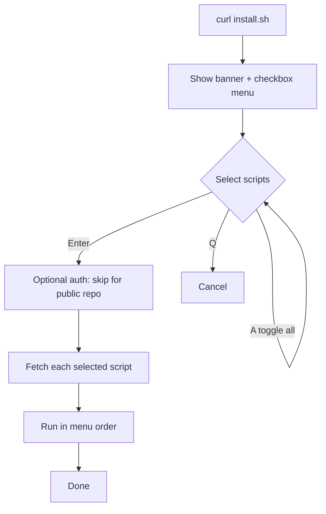

# wanforge.asia — Server Scripts

A collection of Linux server setup and hardening scripts. Run them individually,
or use the interactive launcher `install.sh` which shows a grouped multi-select
checkbox menu and runs the chosen scripts in order.

This is a public repository, so no authentication is required to run the scripts.

## Requirements

- A Linux system with one of these package managers: `apt`, `dnf`, `yum`,
  `pacman`, `zypper`, or `apk`. Some scripts are Debian/Ubuntu only (noted below).
- `curl` and `sudo` access (or run as root). Node.js and Composer install
  user-local and do not use `sudo`.
- An interactive terminal (scripts read input from `/dev/tty`).

## Run via the Launcher

```bash
curl -fsSL https://raw.githubusercontent.com/wanforge/wanforge/master/.shell/install.sh | bash
```

Menu controls:

| Key            | Action                       |
| -------------- | ---------------------------- |
| Up / Down      | Move between rows            |
| Space          | Toggle a selection           |
| A              | Toggle all                   |
| Enter          | Run the selected scripts     |
| Q              | Cancel and exit              |

The menu is grouped by category and runs the selected scripts in menu order. If
one fails, the rest still continue. Auth (GitHub username + token) is shown but
optional — only needed if you fork the scripts into a private repository.

```text
Select scripts to run:  ↑/↓ move · SPACE toggle · A all · ENTER run · Q quit

── System ──
❯ [ ] install-packages     Update system + install base packages (multi-distro)
  [ ] set-timezone         Set timezone (default Asia/Jakarta)
── Security ──
  [ ] install-firewall     Install & configure ufw firewall
  [ ] install-fail2ban     Install & enable Fail2Ban
  [ ] secure-ssh           Harden SSH: change port, disable root/password, pubkey
  [ ] generate-ssh-key     Generate an ed25519 SSH key (user-local)
── Panel & Console ──
  [ ] install-cloudpanel   Install CloudPanel CE v2 (Debian/Ubuntu only)
  [ ] clpctl-manager       Manage CloudPanel via clpctl (sites, db, users, certs)
  [ ] install-cockpit      Install Cockpit web console + modules (Debian/Ubuntu)
── Database ──
  [ ] install-postgresql   Install PostgreSQL + create roles + remote access
  [ ] enable-mysql-remote  Allow remote MySQL/MariaDB access (sensitive)
── App Runtime ──
  [ ] install-nodejs       Install Node.js via nvm (user-local) + PM2
  [ ] install-composer     Install Composer (user-local, signature-verified)
  [ ] setup-pm2-app        Configure pm2-logrotate + register an app (ecosystem)
```

## Run a Single Script

Each script can also be run directly without the launcher.

```bash
# System & base
curl -fsSL https://raw.githubusercontent.com/wanforge/wanforge/master/.shell/install-packages.sh | bash
curl -fsSL https://raw.githubusercontent.com/wanforge/wanforge/master/.shell/set-timezone.sh | bash

# Security
curl -fsSL https://raw.githubusercontent.com/wanforge/wanforge/master/.shell/install-firewall.sh | bash
curl -fsSL https://raw.githubusercontent.com/wanforge/wanforge/master/.shell/install-fail2ban.sh | bash
curl -fsSL https://raw.githubusercontent.com/wanforge/wanforge/master/.shell/secure-ssh.sh | bash
curl -fsSL https://raw.githubusercontent.com/wanforge/wanforge/master/.shell/generate-ssh-key.sh | bash

# Panels & consoles
curl -fsSL https://raw.githubusercontent.com/wanforge/wanforge/master/.shell/install-cloudpanel.sh | bash
curl -fsSL https://raw.githubusercontent.com/wanforge/wanforge/master/.shell/clpctl-manager.sh | bash
curl -fsSL https://raw.githubusercontent.com/wanforge/wanforge/master/.shell/install-cockpit.sh | bash

# Databases
curl -fsSL https://raw.githubusercontent.com/wanforge/wanforge/master/.shell/install-postgresql.sh | bash
curl -fsSL https://raw.githubusercontent.com/wanforge/wanforge/master/.shell/enable-mysql-remote.sh | bash

# App runtime
curl -fsSL https://raw.githubusercontent.com/wanforge/wanforge/master/.shell/install-nodejs.sh | bash
curl -fsSL https://raw.githubusercontent.com/wanforge/wanforge/master/.shell/install-composer.sh | bash
curl -fsSL https://raw.githubusercontent.com/wanforge/wanforge/master/.shell/setup-pm2-app.sh | bash
```

## Scripts Overview

| Group         | Script                   | Purpose                                                          | Sudo | Distro          |
| ------------- | ------------------------ | ---------------------------------------------------------------- | ---- | --------------- |
| —             | `install.sh`             | Grouped checkbox launcher that runs the other scripts            | —    | Any             |
| System        | `install-packages.sh`    | Update/upgrade system, install base packages                     | Yes  | Multi           |
| System        | `set-timezone.sh`        | Set timezone via `timedatectl` (default `Asia/Jakarta`)          | Yes  | Any (systemd)   |
| Security      | `install-firewall.sh`    | Install `ufw`, open SSH/http/https, add custom ports, enable     | Yes  | Mainly Deb/Ubu  |
| Security      | `install-fail2ban.sh`    | Install and enable the Fail2Ban service                          | Yes  | Multi           |
| Security      | `secure-ssh.sh`          | Change SSH port, disable root/password login, enable pubkey      | Yes  | Any (OpenSSH)   |
| Security      | `generate-ssh-key.sh`    | Generate an ed25519 SSH key, fix perms, print public key         | No   | Any             |
| Panel & Console | `install-cloudpanel.sh`| Install CloudPanel CE v2, choose DB engine, verify checksum      | Yes  | Debian/Ubuntu   |
| Panel & Console | `clpctl-manager.sh`    | Manage CloudPanel via `clpctl`: sites, db, users, certs, vhosts  | Yes  | CloudPanel      |
| Panel & Console | `install-cockpit.sh`   | Install Cockpit + modules, reverse-proxy config, open port 9090  | Yes  | Debian/Ubuntu   |
| Database      | `install-postgresql.sh`  | Install latest PostgreSQL (PGDG), create roles, remote access    | Yes  | Debian/Ubuntu   |
| Database      | `enable-mysql-remote.sh` | Remote MySQL/MariaDB: bind-address, firewall, create users       | Yes  | Debian/Ubuntu   |
| App Runtime   | `install-nodejs.sh`      | Install Node.js via nvm (user-local), choose version, PM2        | No   | Any             |
| App Runtime   | `install-composer.sh`    | Install Composer to `~/.local/bin`, verify signature             | No   | Any (needs PHP) |
| App Runtime   | `setup-pm2-app.sh`       | Configure pm2-logrotate + register an app (ecosystem.config.js)  | No   | Any             |

## Script Details

### install-packages.sh

- Detects the package manager: `apt`, `dnf`, `yum`, `pacman`, `zypper`, `apk`.
- **Grouped checkbox menu** (default all on, uncheck to skip): System actions
  (update / upgrade / cleanup) plus per-package selection grouped by Editor,
  Network, VCS, Diagnostics, and Python — each with a description.
- Package names are resolved per distro; falls back to `pip3` for
  `speedtest-cli` where the repo package is missing.

### set-timezone.sh

- Sets the timezone with `timedatectl`. Default `Asia/Jakarta`.
- Type `s` / `skip` to skip, or enter any valid zone (e.g. `UTC`, `Europe/London`).

### install-firewall.sh

- Installs `ufw` if missing, allows OpenSSH, http, https.
- Prompts for extra ports (e.g. `8443/tcp 3000/tcp`).
- Optionally enables the firewall and shows verbose status.

### install-fail2ban.sh

- Installs Fail2Ban via the detected package manager.
- Enables and starts the service (systemd or OpenRC).

### secure-ssh.sh

- Changes the SSH port (default `20829`), disables root login, optionally
  disables password auth, enables pubkey auth.
- Uses a drop-in file under `sshd_config.d/` when `Include` is active, otherwise
  edits the main config. Backs up `sshd_config` first.
- **Anti-lockout**: opens the new port in `ufw` before restarting, validates with
  `sshd -t`, and refuses to disable password auth when no `authorized_keys` exists.
- Asks before restarting and before removing the old port-22 rule.

### generate-ssh-key.sh

- Generates an `ed25519` key in `~/.ssh` (no sudo). Prompts for the file path,
  comment (default `wanforge-asia@<hostname>`), and an optional passphrase.
- Refuses to overwrite an existing key without confirmation. Sets `~/.ssh` to
  `700`, the private key to `600`, the public key to `644`.
- Prints the fingerprint and the public key to paste into GitHub/GitLab
  (Settings → SSH/Deploy Keys).

### install-cloudpanel.sh

- Debian/Ubuntu only. Installs prerequisites, lets you choose the database engine
  (`MARIADB_11.4`, `MARIADB_10.11`, `MYSQL_8.4`, `MYSQL_8.0`).
- Downloads the official installer and verifies its SHA-256 checksum. **Fails
  closed** on mismatch. Update `EXPECTED_SHA` from the CloudPanel docs for new
  releases. Web console at `https://<server-ip>:8443`.

### clpctl-manager.sh

- Requires CloudPanel (`clpctl`). Interactive menu over the documented v2 CLI
  ([reference](https://www.cloudpanel.io/docs/v2/cloudpanel-cli/)). Loops until you quit.
- **CloudPanel**: enable/disable basic auth, Cloudflare IP update.
- **Database**: show master credentials, add, export, import.
- **Certificates**: Let's Encrypt install (with SAN), install custom certificate.
- **Sites**: add PHP / Node.js / Python / Static / Reverse Proxy, delete site.
- **Users**: add (admin/site-manager/user roles), delete, list, reset password,
  disable MFA.
- **vHost templates**: list, import, add, delete, view.
- **System**: reset permissions, purge Varnish cache.
- Passwords are entered interactively (not stored). Note they are passed to
  `clpctl` as flags, so they may briefly appear in the process list.

### install-cockpit.sh

- Debian/Ubuntu only. **Grouped checkbox menu** (default all on, uncheck to skip):
  - **Core** — install Cockpit; open port `9090` in `ufw` (skip if proxied).
  - **Proxy** — write `/etc/cockpit/cockpit.conf` with `AllowOrigins` (bare
    domain, e.g. `cockpit.domain.id` — TLS terminated by CloudPanel),
    `ProtocolHeader`, `AllowUnencrypted`. Add the domain in CloudPanel as a
    reverse proxy to `http://127.0.0.1:9090`.
  - **Network** — install NetworkManager and set the netplan renderer (with a
    backup and an explicit `yes` confirmation, since it can drop SSH).
  - **Plugins** — `networkmanager`, `storaged`, `sosreport`, `pcp`, `machines`,
    `podman` (each individually selectable).
  - **Metrics** — enable `pmcd` + `pmlogger`.
- Console at `http://127.0.0.1:9090`.

### install-postgresql.sh

- Debian/Ubuntu only. Adds the official **PGDG** APT repository to install the
  latest PostgreSQL, plus `postgresql-contrib`.
- Creates login roles interactively — usernames and passwords are entered at
  runtime and never stored in the script. Optional `SUPERUSER` (default off).
- Optional remote access: configures `pg_hba.conf` + `listen_addresses` (paths
  resolved via `SHOW hba_file/config_file`), restarts, and opens `5432` for a
  chosen source CIDR.

### enable-mysql-remote.sh

- Debian/Ubuntu only. Auto-detects the MySQL/MariaDB config file, backs it up,
  sets `bind-address = 0.0.0.0`, restarts the service, and opens `3306` for a
  chosen source CIDR.
- Optionally creates remote DB users: connects as admin (root socket via `sudo`,
  or a root password), then loops to create `user@host` with a password and a
  grant on a chosen database (or all). Host defaults to `%` (any client).
  Passwords are entered interactively and never stored.

### install-nodejs.sh

- Installs `nvm` into `$HOME/.nvm` (no sudo) and the chosen Node version
  (`18`, `20`, `lts`, `latest`). Sets it as the default + stable alias.
- Optionally installs PM2 + `pm2-logrotate`, runs `pm2 save`, and (optionally)
  sets up boot startup via systemd (this single step needs sudo).

### install-composer.sh

- Requires PHP. Installs Composer into `~/.local/bin/composer` (no sudo),
  **verifying the installer SHA-384 signature** before running it.
- Adds `~/.local/bin` to `PATH` in `~/.bashrc` and runs `composer self-update`.

### setup-pm2-app.sh

- Requires PM2 (run `install-nodejs.sh` first). Sources nvm to find PM2.
- Optionally configures `pm2-logrotate` (max size, retention, compression, daily
  rotation).
- Registers an application by generating `ecosystem.config.js` (name, cwd, script,
  args, instances/cluster, `NODE_ENV`, memory restart limit), then runs
  `pm2 start` + `pm2 save`.

## Launcher Flow



## Security Notes

- **Public repo**: never store credentials, tokens, or sensitive data in this
  folder. See `.gitignore` for the blocked patterns.
- **Database credentials**: `install-postgresql.sh` asks for role names and
  passwords interactively. No passwords are stored in these scripts.
- **Remote database access**: `install-postgresql.sh` and `enable-mysql-remote.sh`
  expose the database to the network. Prefer a restricted source CIDR over
  `0.0.0.0/0`, and place the server behind a firewall or private network.
- **SSH hardening**: `secure-ssh.sh` can lock you out. It opens the new port in
  `ufw` before restarting, validates with `sshd -t`, backs up the config, and
  refuses to disable password auth without an `authorized_keys` present. Keep
  your current session open and test the new port before closing it.
- **CloudPanel**: fails closed when the installer checksum does not match.
- **Cockpit**: `AllowUnencrypted = true` is only safe when TLS is terminated by
  the proxy (e.g. CloudPanel) in front of Cockpit.
- **Node.js / Composer**: installed in the current user's home, no `sudo`. PM2
  boot startup (`pm2 startup`) is optional and needs `sudo` for systemd.
- **Disable colors**: set `NO_COLOR=1` before running.

## License

GNU General Public License v3.0 (GPL-3.0). Copyright (c) 2026 Sugeng Sulistiyawan.
See [`LICENSE`](LICENSE).
