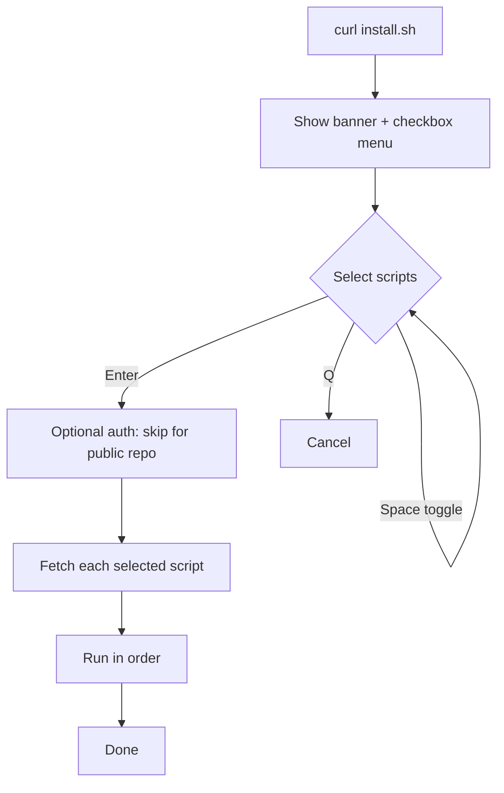

# wanforge.asia — Server Scripts

A collection of Linux server setup scripts. Run them individually, or use the
interactive launcher `install.sh` which shows a multi-select checkbox menu.

This is a public repository, so no authentication is required to run the scripts.

## Requirements

- A Linux system with one of these package managers: `apt`, `dnf`, `yum`,
  `pacman`, `zypper`, or `apk`.
- `curl` and `sudo` access (or run as root).
- An interactive terminal (the scripts read input from `/dev/tty`).

## Run via the Launcher

The easiest way. It shows a menu where you can select one or more scripts at once.

```bash
curl -fsSL https://raw.githubusercontent.com/wanforge/wanforge/master/.shell/install.sh | bash
```

Menu controls:

| Key            | Action                       |
| -------------- | ---------------------------- |
| Up / Down      | Move between rows            |
| Space          | Toggle a selection           |
| A              | Toggle all                   |
| Enter          | Run the selected scripts     |
| Q              | Cancel and exit              |

Selected scripts run in menu order. If one fails, the rest still continue.

## Run a Single Script

Each script can also be run directly without the launcher.

```bash
# Update system + base packages (multi-distro)
curl -fsSL https://raw.githubusercontent.com/wanforge/wanforge/master/.shell/install-packages.sh | bash

# Set timezone (default Asia/Jakarta)
curl -fsSL https://raw.githubusercontent.com/wanforge/wanforge/master/.shell/set-timezone.sh | bash

# Install & configure the ufw firewall
curl -fsSL https://raw.githubusercontent.com/wanforge/wanforge/master/.shell/install-firewall.sh | bash

# Install & enable Fail2Ban
curl -fsSL https://raw.githubusercontent.com/wanforge/wanforge/master/.shell/install-fail2ban.sh | bash

# Install CloudPanel CE v2 (Debian/Ubuntu only)
curl -fsSL https://raw.githubusercontent.com/wanforge/wanforge/master/.shell/install-cloudpanel.sh | bash

# Install Cockpit web console + modules (Debian/Ubuntu)
curl -fsSL https://raw.githubusercontent.com/wanforge/wanforge/master/.shell/install-cockpit.sh | bash

# Install PostgreSQL, create roles, optional remote access
curl -fsSL https://raw.githubusercontent.com/wanforge/wanforge/master/.shell/install-postgresql.sh | bash

# Allow remote MySQL/MariaDB access (sensitive)
curl -fsSL https://raw.githubusercontent.com/wanforge/wanforge/master/.shell/enable-mysql-remote.sh | bash

# Install Node.js via nvm (user-local) + PM2
curl -fsSL https://raw.githubusercontent.com/wanforge/wanforge/master/.shell/install-nodejs.sh | bash

# Install Composer (user-local, signature-verified)
curl -fsSL https://raw.githubusercontent.com/wanforge/wanforge/master/.shell/install-composer.sh | bash

# Harden SSH (change port, disable root/password, pubkey)
curl -fsSL https://raw.githubusercontent.com/wanforge/wanforge/master/.shell/secure-ssh.sh | bash
```

## Scripts

| Script                  | Purpose                                                          | Interactive |
| ----------------------- | ---------------------------------------------------------------- | ----------- |
| `install.sh`            | Checkbox menu launcher that runs the other scripts               | Yes         |
| `install-packages.sh`   | Update/upgrade the system and install base packages              | No          |
| `set-timezone.sh`       | Set the timezone via `timedatectl`, default `Asia/Jakarta`       | Yes         |
| `install-firewall.sh`   | Install `ufw`, open OpenSSH/http/https, add custom ports, enable | Yes         |
| `install-fail2ban.sh`   | Install and enable the Fail2Ban service                          | Yes         |
| `install-cloudpanel.sh` | Install CloudPanel CE v2, choose DB engine, verify checksum      | Yes         |
| `install-cockpit.sh`    | Install Cockpit + modules, reverse-proxy config, open port 9090  | Yes         |
| `install-postgresql.sh` | Install PostgreSQL, create roles (interactive), remote access    | Yes         |
| `enable-mysql-remote.sh`| Set bind-address and firewall for remote MySQL/MariaDB access    | Yes         |
| `install-nodejs.sh`     | Install Node.js via nvm (user-local, no sudo), choose version, PM2 | Yes       |
| `install-composer.sh`   | Install Composer to `~/.local/bin` (no sudo), verify signature   | No          |
| `secure-ssh.sh`         | Change SSH port, disable root/password login, enable pubkey auth | Yes         |

## Launcher Flow



## Notes

- **Public repo**: never store credentials, tokens, or sensitive data in this
  folder. See `.gitignore` for the blocked patterns.
- **CloudPanel**: Debian/Ubuntu only. The script fails closed (`exit`) when the
  installer checksum does not match. For a new release, update `EXPECTED_SHA` in
  `install-cloudpanel.sh` from the official CloudPanel docs.
- **Firewall**: `ufw` is mainly for Debian/Ubuntu. On other distros the script
  attempts to install it from the respective repository.
- **Database credentials**: `install-postgresql.sh` asks for role names and
  passwords interactively. No passwords are stored in these scripts.
- **Remote database access**: `install-postgresql.sh` and `enable-mysql-remote.sh`
  expose the database to the network. Prefer a restricted source CIDR over
  `0.0.0.0/0`, and place the server behind a firewall or private network.
- **Cockpit reverse proxy**: `AllowUnencrypted = true` is only safe when TLS is
  terminated by the proxy (e.g. CloudPanel) in front of Cockpit.
- **Node.js / Composer**: installed in the current user's home, no `sudo`. PM2
  boot startup (`pm2 startup`) is optional and needs `sudo` for systemd.
- **SSH hardening**: `secure-ssh.sh` can lock you out. It opens the new port in
  `ufw` before restarting, validates with `sshd -t`, backs up the config, and
  refuses to disable password auth without an `authorized_keys` present. Keep
  your current session open and test the new port before closing it.
- **Disable colors**: set `NO_COLOR=1` before running.

## License

MIT. Copyright (c) 2026 Sugeng Sulistiyawan. See `LICENSE`.
