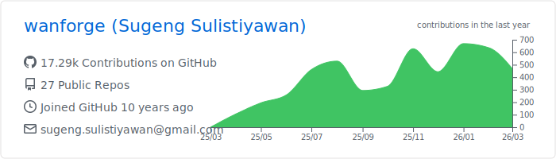
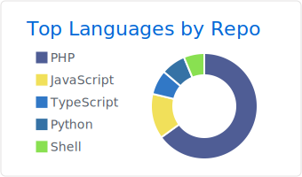
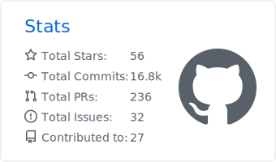

<h1 align="center">Sugeng Sulistiyawan</h1>

<b>Senior Full-Stack &amp; DevOps Engineer</b> — I turn business problems into systems that scale and stay up.

East Java, Indonesia · shipping production software since 2015

  
  
  
  
  

---

### Impact

- **150+** production web apps · **50+** IoT systems · **10,000+** daily users served
- **80%** faster deployments · **40%** lower cloud cost · **60%** faster queries
- **8+ years** enterprise · led teams up to **10** · GitHub member since **2015**

### What I do

Full-stack development, server automation, and infrastructure that runs reliably in
production — from database design to frontend, from CI/CD to monitoring and IoT.

**Currently** building server automation, real-time monitoring, and cloud-native
microservices for healthcare systems at **RSUD dr. Soedomo Trenggalek**.

### Stack

**Backend** PHP (Laravel · Yii2) · Node.js (NestJS · Express) · Python (FastAPI · Django) · Go
**Frontend** React · Vue · Angular · TypeScript · Tailwind
**DevOps** Docker · Kubernetes · Terraform · Ansible · GitHub Actions · Nginx
**Cloud** AWS · Google Cloud · Cloudflare
**Data** PostgreSQL · MySQL · MongoDB · Redis · RabbitMQ
**Observability** Prometheus · Grafana · ELK
**IoT** Arduino · ESP32 · Raspberry Pi

  
  
  
  
  
  
  
  
  
  
  
  
  
  
  
  
  
  
  

### GitHub

 

<b>Experience</b> (click to expand)

**Full-Stack Developer, DevOps & Server Admin** · RSUD dr. Soedomo Trenggalek · *2024–Present*
Healthcare systems: PHP/Python/Node.js apps, Prometheus+Grafana monitoring, AWS, Mikrotik/Ruijie networking, MySQL/PostgreSQL with replication.

**Freelance Full-Stack & DevOps Engineer** · *2015–Present*
100+ clients. 150+ web apps, 50+ IoT solutions, 30+ cloud migrations, IaC with Terraform/Ansible, CI/CD cutting deploy time 80%.

**Full-Stack / Backend Developer & DevOps** · Matador Lectro, Surakarta · *2021–2024*
APIs for 10,000+ IoT devices, microservices handling 1M+ requests/day, RabbitMQ + Redis, React Native/Flutter apps.

**Leadership** · Project Manager, Firmware Engineer (Matador Lectro); CEO/Developer (Die Coding, IMPERDEV); Director/COO (PT Wawasan Maju Nusantara); Developer (UNS UPT TIK).

### Let's build something

Open to **DevOps / Full-Stack / Tech Lead** roles, consulting, and freelance work.

📫 **[sugeng.sulistiyawan@gmail.com](mailto:sugeng.sulistiyawan@gmail.com)** · 🌐 **[wanforge.github.io](https://wanforge.github.io)** · 💼 **[LinkedIn](https://linkedin.com/in/sugengsulistiyawan)**
