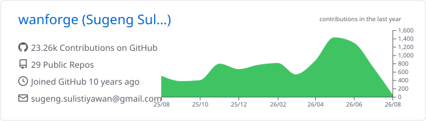
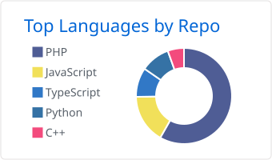
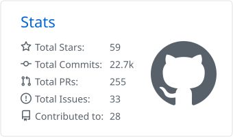

# Sugeng Sulistiyawan (wanforge)

<p align="left">
  <b>Senior Full-Stack &amp; DevOps Engineer @ <a href="https://docobyte.com">DOCOBYTE</a></b><br>
  I build scalable backend systems, automate cloud infrastructure, and design IoT solutions.
</p>

<p align="left">
  <a href="https://docobyte.com"></a>
  <a href="https://linkedin.com/in/sugengsulistiyawan"></a>
  <a href="mailto:sugeng.sulistiyawan@gmail.com"></a>
</p>

---

### Quick Impact
* **200+** Web Applications delivered
* **50+** IoT Systems integrated
* **80%** Faster deployment workflows via CI/CD
* **40%** Cloud infrastructure cost reduction

---

### Tech Stack

```
Backend      :: Go • Node.js • Python • PHP (Laravel)
DevOps/Cloud :: Docker • Kubernetes • Terraform • Ansible • AWS • GCP
Databases    :: PostgreSQL • MySQL • MongoDB • Redis • RabbitMQ
IoT          :: ESP32 • Arduino • Raspberry Pi
Observability:: Prometheus • Grafana • ELK
```

---

### Server Automation Toolkit — [`scripts`](https://github.com/wanforge/scripts)

```bash
curl -fsSL https://raw.githubusercontent.com/wanforge/scripts/master/install.sh | bash
```
*Interactive one-command Linux server setup & security hardening.*

---

### GitHub Activity

<div align="center">
  
  
  
</div>

---

<details>
<summary><b>Professional Experience</b> (Click to expand)</summary>

* **Full-Stack Developer & DevOps** @ RSUD dr. Soedomo Trenggalek *(2024 - Present)*
* **Founder & Lead Engineer** @ DOCOBYTE *(2015 - Present)*
* **IoT Full-Stack / Backend & DevOps** @ Matador Lectro *(2021 - 2024)*

</details>

---

<p align="center">
  <a href="https://docobyte.com">docobyte.com</a> · 
  <a href="mailto:sugeng.sulistiyawan@gmail.com">sugeng.sulistiyawan@gmail.com</a>
</p>
