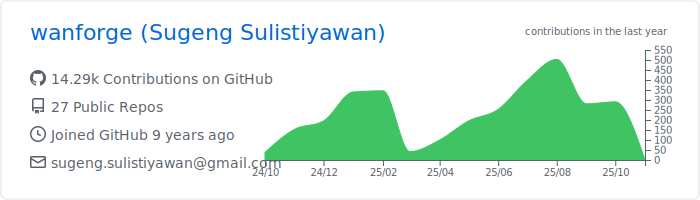
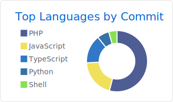
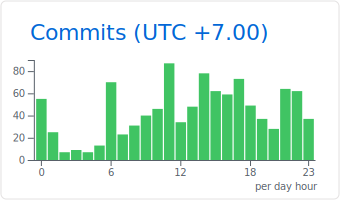

# Sugeng Sulistiyawan

**Senior Software Engineer | Full Stack Developer | DevOps Specialist**  
Tulungagung & Trenggalek, East Java, Indonesia

---

## Professional Summary

Senior Software Engineer with nearly a decade of professional experience building production-grade systems. Specialized in full-stack development, server automation, infrastructure monitoring, and DevOps engineering. Proven track record of architecting and delivering 150+ scalable web applications and 50+ IoT systems that serve thousands of users daily across healthcare, enterprise, and SME sectors in Indonesia.

Expert in transforming business requirements into robust technical solutions with strong emphasis on automation, observability, and high availability. Experienced in leading development teams, managing complex infrastructure, and implementing DevOps best practices that reduce deployment time by 80% and improve system reliability.

**Current Focus:** Server Automation & Orchestration, Real-time Infrastructure Monitoring, CI/CD Pipeline Optimization, Cloud-Native Architecture, Microservices Development

**Professional Milestones:**

- 10+ years in software development (GitHub member since 2015)
- 8+ years enterprise experience (professional career since 2017)
- 150+ production web applications delivered and maintained
- 50+ IoT systems deployed in industrial and commercial environments
- 200+ branding and design projects completed
- Managed infrastructure serving 10,000+ daily active users
- Led development teams of up to 10 engineers
- Reduced infrastructure costs by 40% through cloud optimization

---

## What I Bring to the Table

**Full-Stack Development**  
End-to-end application development from database design to frontend UI/UX, with expertise in PHP (Yii2, Laravel, CodeIgniter), Node.js, Python, and modern JavaScript frameworks (React, Vue.js, Angular).

**DevOps & Infrastructure**  
Server automation, infrastructure as code, CI/CD pipeline implementation, container orchestration with Docker and Kubernetes, and cloud architecture on AWS, Google Cloud Platform, and on-premises environments.

**Server Automation & Monitoring**  
Automated deployment workflows, server health monitoring, log aggregation, alert systems, and performance optimization for high-availability production environments.

**IoT & Hardware Integration**  
Developing embedded systems with Arduino, ESP32, and Raspberry Pi. Building sensor networks, data acquisition systems, and hardware-software integration solutions.

**Technical Leadership**  
Leading development teams, establishing coding standards, conducting code reviews, and mentoring junior developers. Experience in project management and stakeholder communication.

---

## Technical Expertise

-000000?style=flat&logo=espressif&logoColor=white)

---

## Professional Experience

### Full-stack Developer, DevOps, Network Operator & Server Admin

**RSUD dr. Soedomo Trenggalek** | June 2024 - Present

Leading the development and infrastructure management for critical healthcare systems serving thousands of patients and medical staff.

**Key Responsibilities:**

- Architecting and developing healthcare web applications using PHP (Yii2, Laravel), Python, and Node.js
- Implementing server automation workflows for deployment, backup, and disaster recovery
- Building monitoring dashboards with Prometheus and Grafana for real-time infrastructure health tracking
- Managing cloud infrastructure on AWS (EC2, S3, RDS) with auto-scaling and high availability
- Administering bare-metal and virtual servers running Ubuntu and CentOS
- Configuring and maintaining network infrastructure with Mikrotik and Ruijie
- Implementing CI/CD pipelines with GitHub Actions and GitLab CI
- Database administration and optimization for MySQL and PostgreSQL with replication setup
- Setting up message queuing systems with RabbitMQ (AMQP) for microservices communication
- Implementing caching strategies with Redis for performance optimization
- Developing RESTful APIs and integrating third-party services

**Technologies:** PHP, Python, Yii Framework, Laravel, AngularJS, Node.js, AWS S3, AWS EC2, AWS RDS, Ubuntu Server, CentOS, Bare-metal Servers, RabbitMQ, Redis, MySQL, PostgreSQL, DNS, Mikrotik, Ruijie, Prometheus, Grafana, Nginx, Docker

---

### Freelance Full-Stack Developer & DevOps Engineer

**Self-Employed** | 2015 - Present

Providing comprehensive software development and infrastructure services to 100+ clients including healthcare facilities, enterprises, and SMEs across Indonesia.

**Achievements:**

- **150+ Web Applications:** Delivered custom ERP, CRM, hospital management systems, e-commerce platforms, and business automation tools
- **50+ IoT Solutions:** Developed smart monitoring systems, sensor networks, industrial automation, and data acquisition systems using Arduino, ESP32, and Raspberry Pi
- **200+ Design Projects:** Created corporate branding, logo designs, UI/UX designs, and marketing materials
- **Cloud Migration Projects:** Successfully migrated 30+ legacy applications to cloud infrastructure (AWS, GCP) with improved performance and reduced costs
- **Server Automation:** Implemented automated deployment, monitoring, and backup solutions for 50+ production servers
- **Mobile Applications:** Built and published cross-platform mobile apps using Flutter and React Native to Google Play Store and App Store

**Technical Highlights:**

- Implemented Infrastructure as Code using Terraform and Ansible for automated server provisioning
- Built comprehensive monitoring solutions with Prometheus, Grafana, and ELK Stack
- Designed and deployed microservices architectures with Docker and Kubernetes
- Established CI/CD pipelines reducing deployment time by 80%
- Optimized database queries resulting in 60% performance improvement
- Implemented automated backup and disaster recovery procedures
- Configured load balancers and reverse proxies with Nginx for high-traffic applications
- Set up VPN solutions and network security with Mikrotik routers

**Technologies:** Full-stack web development (PHP, Python, Node.js, React, Vue.js, Angular), Mobile development (Flutter, React Native), Cloud platforms (AWS, Google Cloud), DevOps tools (Docker, Kubernetes, Ansible, Terraform, Jenkins), Databases (MySQL, PostgreSQL, MongoDB, Redis), IoT (Arduino, ESP32, Raspberry Pi), Server administration (Linux, Ubuntu, CentOS)

---

### Full-stack Developer & DevOps Engineer

**Matador Lectro, Surakarta** | August 2023 - May 2024

Led the development of IoT platforms and mobile applications for smart home and industrial automation products.

**Key Contributions:**

- Developed RESTful APIs serving 10,000+ IoT devices using Node.js and PHP
- Built mobile applications with React Native and Flutter published to Google Play Store
- Managed AWS infrastructure (EC2, S3, RDS) with automated scaling and monitoring
- Implemented message queuing with RabbitMQ for reliable device communication
- Set up Redis caching reducing API response time by 70%
- Configured CI/CD pipelines with GitHub Actions for automated testing and deployment
- Implemented SEO strategies improving organic traffic by 150%
- Administered PostgreSQL and MySQL databases with replication and backup automation

**Technologies:** PHP, Yii Framework, Node.js, Arduino, React Native, Flutter, AWS EC2, AWS S3, AWS RDS, RabbitMQ, Redis, PostgreSQL, MySQL, DNS, Nginx, Docker

---

### Backend Developer & DevOps Engineer

**Matador Lectro, Surakarta** | August 2021 - August 2023

**Achievements:**

- Architected microservices-based backend infrastructure handling 1M+ API requests daily
- Implemented automated deployment workflows reducing release time from hours to minutes
- Developed comprehensive API documentation and technical specifications
- Set up monitoring and alerting systems for proactive issue detection
- Optimized database queries and indexes improving application performance by 50%
- Managed cloud infrastructure across AWS and Google Cloud Platform
- Established coding standards and conducted code reviews for development team

**Technologies:** PHP, Yii Framework, Node.js, Python, AWS, Google Cloud Platform, MySQL, PostgreSQL, Redis, Docker, Git, Nginx, On-premises Infrastructure

---

### Additional Leadership Roles

**Project Manager** | Matador Lectro, Surakarta | September 2022 - August 2023

- Led cross-functional teams of 5-10 developers and designers
- Managed project budgets averaging IDR 500M+ per project
- Coordinated with stakeholders and delivered projects on time and within budget
- Implemented Agile methodologies improving team productivity by 40%

**Firmware Engineer** | Matador Lectro, Surakarta | August 2021 - August 2022

- Developed embedded systems firmware for IoT devices using C++ and Arduino
- Designed and implemented comprehensive testing procedures for hardware-software integration
- Optimized firmware reducing power consumption by 30%
- Collaborated with hardware engineers on PCB design and component selection

**CEO & Developer** | IMPERDEV, Trenggalek | 2022 - 2023

- Founded and led technology startup focused on web and mobile solutions
- Managed client relationships and business development
- Oversaw technical architecture and development processes

**Director & COO** | PT Wawasan Maju Nusantara, Trenggalek | 2021 - Present

- Strategic planning and operational management for business development
- Partnership development and market expansion initiatives

**Technology Innovation & Developer** | Innovation Hub Universitas Sebelas Maret | April 2021 - August 2021

- Developed innovative solutions for university research projects
- Integrated multiple APIs and third-party services
- Mentored student developers on modern development practices

**Staff IT** | RSUD Soedomo, Trenggalek | November 2020 - January 2021

- Provided IT support for hospital information systems
- Database administration and optimization
- Network configuration and troubleshooting with Mikrotik

**CEO & Developer** | Die Coding Technology, Surakarta | 2017 - Present

- Leading software development company delivering custom solutions
- Managing project lifecycle from requirements to deployment
- Building long-term client relationships

**Software Developer** | UPT TIK Universitas Sebelas Maret | March 2017 - March 2019

- Developed university information systems and student portals
- Maintained and upgraded legacy applications
- Provided technical support for IT infrastructure

---

## Core Competencies

### Technical Excellence

- **Backend Development:** Expert in PHP (Yii2, Laravel), Node.js, Python (Django, Flask, FastAPI)
- **Frontend Development:** Advanced proficiency in React, Vue.js, Angular, TypeScript
- **DevOps & Infrastructure:** Docker, Kubernetes, Ansible, Terraform, CI/CD pipelines
- **Server Automation:** Bash scripting, Python automation, cron jobs, systemd services
- **Monitoring & Observability:** Prometheus, Grafana, ELK Stack, application performance monitoring
- **Cloud Platforms:** AWS (EC2, S3, RDS, Lambda), Google Cloud Platform
- **Database Management:** MySQL, PostgreSQL, MongoDB, Redis with replication and sharding
- **Network Administration:** Mikrotik, DNS, VPN, firewall configuration, load balancing
- **Mobile Development:** Flutter, React Native, native Android
- **IoT Development:** Arduino, ESP32, Raspberry Pi, sensor integration
- **Design:** UI/UX design, branding, vector graphics

### Professional Skills

- **Leadership:** Team management, mentoring, technical leadership
- **Project Management:** Agile/Scrum methodologies, sprint planning, risk management
- **Communication:** Technical documentation, stakeholder presentations, cross-team collaboration
- **Problem Solving:** Root cause analysis, debugging, performance optimization
- **Architecture:** Microservices, scalable systems, security best practices
- **Business Acumen:** Client relations, requirement gathering, ROI analysis

---

## GitHub Statistics

 
 

---

## Why Work With Me

**Proven Track Record:** 10+ years of active development with 150+ successful projects delivered to satisfied clients across Indonesia.

**Full-Stack Expertise:** From database design to frontend UI, from server automation to mobile apps - I handle the complete technology stack.

**DevOps Excellence:** I don't just write code, I ensure it runs reliably in production with proper monitoring, automation, and scalability.

**Business Understanding:** I understand that technology serves business goals. I focus on delivering solutions that drive real value and ROI.

**Communication:** I translate complex technical concepts into clear language for stakeholders and provide comprehensive documentation.

**Continuous Learning:** Always staying current with latest technologies and best practices to deliver cutting-edge solutions.

---

## Let's Build Something Great

I'm always interested in challenging projects that push the boundaries of what's possible. Whether you need a scalable web application, infrastructure automation, IoT integration, or complete digital transformation - let's talk.

**Open to:**

- Full-time positions in DevOps, Full-Stack Development, or Technical Leadership roles
- Consulting engagements for infrastructure optimization and automation
- Freelance projects for web applications, mobile apps, and IoT solutions
- Technical advisory and mentorship opportunities

---

## Contact

**Email:** sugeng.sulistiyawan@gmail.com  
**Portfolio:** [wanforge.github.io](https://wanforge.github.io)  
**LinkedIn:** [linkedin.com/in/sugengsulistiyawan](https://linkedin.com/in/sugengsulistiyawan)  
**GitHub:** [github.com/wanforge](https://github.com/wanforge)  
**GitLab:** [gitlab.com/wanforge](https://gitlab.com/wanforge)

---

  
  

  <i>Building robust systems, one commit at a time since 2015</i>

